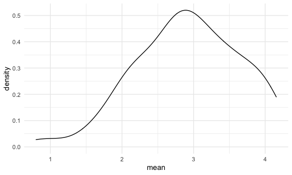
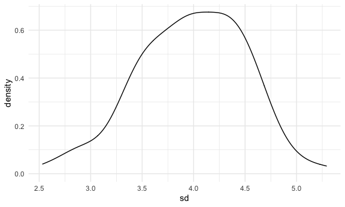

simulations
================
Binyam Yilma
11/17/2020

## Let’s simulate something

Function

``` r
sim_mean_sd = function(samp_size, mu = 3, sigma = 4) {
  
  sim_data = 
    tibble(
      x = rnorm(n = samp_size, mean = mu, sd = sigma)
    )
  sim_data %>% 
    summarize(
      mean = mean(x),
      sd = sd(x)
    )
}
```

simultating something

``` r
sim_mean_sd(samp_size = 100, mu = 6, sigma = 3)
```

    ## # A tibble: 1 x 2
    ##    mean    sd
    ##   <dbl> <dbl>
    ## 1  6.33  2.69

``` r
sim_mean_sd(mu = 6, samp_size = 100, sigma = 3)
```

    ## # A tibble: 1 x 2
    ##    mean    sd
    ##   <dbl> <dbl>
    ## 1  5.89  2.87

``` r
sim_mean_sd(samp_size = 100)
```

    ## # A tibble: 1 x 2
    ##    mean    sd
    ##   <dbl> <dbl>
    ## 1  3.12  4.14

Let’s simulate a lot a lot Let’s start w a for-loop

``` r
output = vector("list", length = 100)

for (i in 1:100) {
  output[[i]]  = sim_mean_sd(samp_size = 30)
}


bind_rows(output)
```

    ## # A tibble: 100 x 2
    ##     mean    sd
    ##    <dbl> <dbl>
    ##  1  3.87  3.79
    ##  2  3.00  4.16
    ##  3  2.27  4.06
    ##  4  3.94  3.63
    ##  5  1.80  4.67
    ##  6  3.08  4.21
    ##  7  3.15  5.42
    ##  8  2.68  3.70
    ##  9  2.47  3.64
    ## 10  3.31  4.29
    ## # … with 90 more rows

Let’s use a loop function

``` r
sim_results = rerun(100, sim_mean_sd(samp_size = 30)) %>% 
  bind_rows()
```

Let’s look at results

``` r
sim_results %>% 
  ggplot(aes(x = mean)) +
  geom_density()
```



``` r
sim_results %>% 
  summarize(
    avg_samp_mean = mean(mean),
    sd_samp_mean = sd(mean)
  )
```

    ## # A tibble: 1 x 2
    ##   avg_samp_mean sd_samp_mean
    ##           <dbl>        <dbl>
    ## 1          2.91        0.725

``` r
sim_results %>% 
  ggplot(aes(x = sd)) +
  geom_density()
```


